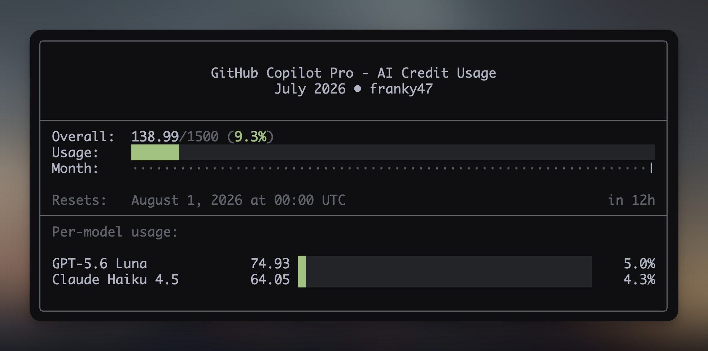

> A GitHub CLI extension that shows your GitHub Copilot AI credit usage



## Features

- 📊 Shows your AI credit use for the current month
- 📅 Shows where you are in the billing cycle
- 🤖 Breaks down AI credit use by model
- 🎨 Uses color-coded progress bars (green → yellow → red)
- ⚙️ Supports plan and allowance settings

The month indicator helps you pace your usage throughout the billing cycle:

- Usage left of the month indicator? Prompt away! 🤖
- Usage right of the month indicator? Go touch some grass. 🌿

## Installation

### Install as a gh extension (recommended)

```bash
gh extension install franky47/gh-copilot-usage
```

This will automatically download the appropriate precompiled binary for your platform. No additional dependencies required!

### Install from source (for development)

If you want to contribute or customize the extension:

```bash
# Clone the repository
git clone https://github.com/franky47/gh-copilot-usage
cd gh-copilot-usage

# Install dependencies
bun install

# Install as local extension
gh extension install .
```

**Requirements for source installation:**

- [Bun](https://bun.sh/) runtime
- [GitHub CLI](https://cli.github.com/) (`gh`)

## Usage

```bash
# Basic usage (uses default plan and limit)
gh copilot-usage

# Specify a plan (uses plan's default limit)
gh copilot-usage --plan pro+

# Specify a custom limit (overrides plan limit)
gh copilot-usage --limit 500

# Combine plan and custom limit (shows plan in UI, uses custom limit)
gh copilot-usage --plan max --limit 25000

# Show help
gh copilot-usage --help

# Show version
gh copilot-usage --version
```

## Configuration

You can set the plan and monthly AI credit allowance. The extension checks each setting in the order shown below.

### Plan Configuration

The plan sets the name in the UI and the default allowance. You can set it in these ways:

1. **CLI flag** (highest priority)

   ```bash
   gh copilot-usage --plan pro+
   ```

2. **Environment variable**

   ```bash
   export GH_COPILOT_PLAN=pro+
   gh copilot-usage
   ```

3. **gh config**

   ```bash
   gh config set copilot-usage.plan pro+
   gh copilot-usage
   ```

4. **Default value** (Pro)
   ```bash
   gh copilot-usage
   ```

### Limit Configuration

A custom limit overrides the plan's AI credit allowance. The extension reads it in this order:

1. **CLI flag** (highest priority)

   ```bash
   gh copilot-usage --limit 500
   ```

2. **Environment variable**

   ```bash
   export GH_COPILOT_LIMIT=500
   gh copilot-usage
   ```

3. **gh config**

   ```bash
   gh config set copilot-usage.limit 500
   gh copilot-usage
   ```

4. **Plan's default allowance**

### Available Plans

| Plan | Monthly AI credits | Description |
|------|-------------------:|-------------|
| `free` | Not fixed | GitHub Copilot Free |
| `student` | Not fixed | GitHub Copilot Student |
| `pro` | 1,500 | GitHub Copilot Pro (default) |
| `pro+` | 7,000 | GitHub Copilot Pro+ |
| `max` | 20,000 | GitHub Copilot Max |

GitHub does not publish a fixed AI credit allowance for Copilot Free or Student. The extension shows raw use for these plans. Set `--limit` to show a percentage and progress bars.

## Requirements

- [GitHub CLI](https://cli.github.com/) (`gh`) must be installed and authenticated
- Your GitHub account must have the `user` scope for billing API access
  - If you see an auth error, run: `gh auth refresh -h github.com -s user`
- User-level reports only include Copilot plans billed to your personal account. The extension does not support plans billed through an organization.

## How it Works

The extension reads the GitHub billing AI credit report for your user account. It shows:

- AI credits used against your monthly allowance
- Your current place in the billing cycle
- AI credit use by model
- The next reset date

One AI credit equals $0.01 USD. GitHub resets included credits at 00:00 UTC on the first day of each month.

Annual Pro and Pro+ plans can still use the old premium request billing model until they expire. The extension falls back to the premium request report and old plan limit when the AI credit report is not available.

## Upgrading

To upgrade to the latest version:

```bash
gh extension upgrade copilot-usage
```

Or upgrade all extensions:

```bash
gh extension upgrade --all
```

## Uninstalling

```bash
gh extension remove copilot-usage
```

## Contributing

Contributions are welcome! Please feel free to submit a Pull Request.

### Development

```bash
# Install dependencies
bun install

# Run locally
bun run src/main.ts

# Build for local platform
bun run build

# Build for all platforms
bun run build:all
```

### Creating a Release

Releases are automated via GitHub Actions. To create a new release:

1. Update the version in `package.json`
2. Commit your changes
3. Create and push a git tag:
   ```bash
   git tag v1.0.1
   git push origin v1.0.1
   ```
4. GitHub Actions will automatically:
   - Build binaries for all platforms (macOS, Linux, Windows)
   - Create a GitHub release
   - Attach the compiled binaries to the release

Users can then upgrade with: `gh extension upgrade copilot-usage`

## License

MIT - see [LICENSE](./LICENSE) for details

## Credits

Made with ❤️ by [François Best](https://github.com/franky47)
